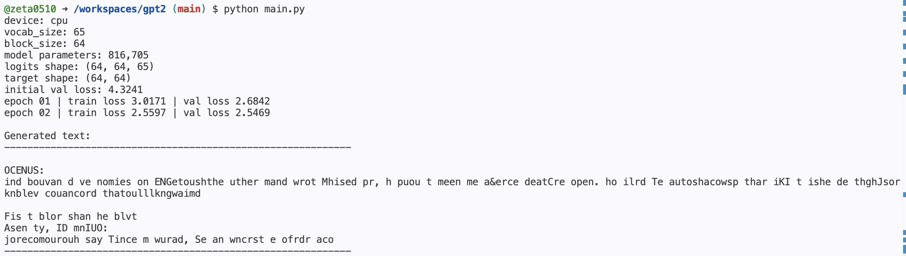

# GPT-2
# 인공지능과 금융공학 최종 프로젝트

이 저장소는 수업 시간에 다룬 character-level language model의 발전 과정을 바탕으로, 최종적으로 **Notebook 6의 Tiny GPT 구조**를 정리하여 구현한 프로젝트입니다.

프로젝트의 목표는 단순히 GPT 코드를 실행하는 것이 아니라, 7주차부터 13주차까지 수업에서 다룬 흐름을 따라가며 다음 개념들이 어떻게 연결되는지 이해하고 설명하는 것입니다.

- Dataset Class
- Bigram Model
- one-hot encoding
- embedding
- MLP language model
- GPT-style shifted dataset
- positional embedding
- masked self-attention
- scaled dot-product attention
- multi-head attention
- feedforward network
- residual connection
- layer normalization
- autoregressive text generation

최종 구현은 `notebook_06.py`의 Tiny GPT 구조를 기반으로 하였고, 실행 가능한 Python 프로젝트 형태로 정리했습니다.

---

## 1. Project Summary

본 프로젝트는 tiny Shakespeare 데이터를 이용하여 문자 단위 GPT 모델을 학습시키는 프로젝트입니다.

모델은 이전 문자들을 보고 다음 문자를 예측하는 **next-token prediction** 문제를 학습합니다.  
즉, GPT의 핵심 목표는 다음과 같습니다.

```text
given previous tokens → predict the next token
```

예를 들어 문장이 다음과 같다면,

```text
I am a student.
```

모델은 다음과 같은 예측 문제를 반복해서 풉니다.

```text
I        -> " "
I_       -> "a"
I_a      -> "m"
I_am     -> " "
I_am_    -> "a"
...
```

초기 notebook에서는 단순한 Dataset과 Bigram model에서 출발했고, 최종적으로는 masked self-attention을 사용하는 Tiny GPT 구조로 발전했습니다.

---

## 2. Repository Structure

```text
gpt2/
├── README.md
├── requirements.txt
├── dataset.py
├── model.py
├── train.py
├── generate.py
├── main.py
├── notebooks/
│   ├── notebook_01.py
│   ├── notebook_02.py
│   ├── notebook_03.py
│   ├── notebook_04.py
│   ├── notebook_05.py
│   └── notebook_06.py
└── screenshots/
```

각 파일의 역할은 다음과 같습니다.

| File | Role |
|---|---|
| `dataset.py` | tiny Shakespeare 다운로드, vocabulary 생성, encoding/decoding, next-token dataset 구성 |
| `model.py` | TinyGPT 모델 구현, masked self-attention, multi-head attention, transformer block |
| `train.py` | sequence cross entropy loss, training loop, evaluation loop |
| `generate.py` | 학습된 모델을 이용한 text generation |
| `main.py` | 전체 실행 파일 |
| `notebooks/` | 수업 시간에 다룬 notebook 1~6 발전 과정 보관 |
| `screenshots/` | 실행 결과 캡처 보관 |

---

## 3. Development Flow from Class Notebooks

수업 코드는 `notebooks/` 폴더에 보관했습니다.

```text
notebooks/
├── notebook_01.py
├── notebook_02.py
├── notebook_03.py
├── notebook_04.py
├── notebook_05.py
└── notebook_06.py
```

이 프로젝트의 최종 구현은 `notebook_06.py`를 중심으로 하지만, README에서는 1번부터 6번까지 어떤 흐름으로 발전했는지 함께 정리했습니다.

---

## 4. Notebook 1: Dataset Class

초기 단계의 목표는 **Dataset Class를 만드는 것**이었습니다.

language model은 문자열 전체를 한 번에 외우는 것이 아니라, 일정 길이의 이전 token들을 보고 다음 token을 예측합니다.  
이때 `block_size`는 모델이 한 번에 볼 수 있는 context 길이를 의미합니다.

예를 들어 `block_size = 4`이고 text가 다음과 같다고 합시다.

```text
hello world
```

그러면 dataset은 다음과 같은 학습 예시를 만들 수 있습니다.

```text
x = "hell"  -> y = "ello"
x = "ello"  -> y = "llo "
x = "llo "  -> y = "lo w"
```

즉, input sequence와 target sequence는 한 칸씩 밀려 있습니다.

이 프로젝트의 `dataset.py`에서는 이를 다음과 같이 구현했습니다.

```python
x = self.data[idx : idx + self.block_size]
y = self.data[idx + 1 : idx + self.block_size + 1]
```

여기서 핵심은 다음과 같습니다.

- `x`: 모델이 보는 입력 sequence
- `y`: 각 위치에서 맞혀야 하는 다음 token
- `block_size`: 모델이 참고할 수 있는 이전 token의 최대 길이

이 구조가 이후 GPT-style dataset의 기본이 됩니다.

---

## 5. Notebook 2~3: Bigram Model

다음 단계에서는 가장 단순한 language model인 **Bigram model**을 다루었습니다.

Bigram model은 현재 token 하나만 보고 다음 token을 예측합니다.

```text
current token -> next token
```

예를 들어 현재 문자가 `a`라면 다음 문자가 무엇일지 예측합니다.  
이 모델은 매우 단순하지만, language modeling의 가장 기본적인 구조를 보여줍니다.

초기 구현에서는 각 문자를 one-hot vector로 표현했습니다.

one-hot vector는 vocabulary size만큼의 길이를 가지며, 해당 token 위치만 1이고 나머지는 0인 vector입니다.

예를 들어 vocabulary size가 5라면,

```text
token id = 2
one-hot = [0, 0, 1, 0, 0]
```

입니다.

Bigram model은 다음과 같이 이해할 수 있습니다.

```text
logits = W × one_hot(input)
```

즉, input token에 해당하는 row 또는 column을 선택하여 다음 token에 대한 점수, 즉 logits를 만드는 구조입니다.

하지만 one-hot representation은 다음 한계가 있습니다.

1. vocabulary가 커지면 vector가 너무 커집니다.
2. 대부분의 값이 0이므로 sparse합니다.
3. token 사이의 유사성을 dense하게 표현하지 못합니다.

이 한계를 극복하기 위해 다음 단계에서 embedding을 사용합니다.

---

## 6. Notebook 4: Embedding and MLP

one-hot vector 대신 **embedding**을 사용하면 각 token을 학습 가능한 dense vector로 표현할 수 있습니다.

Embedding은 일종의 lookup table입니다.

```python
nn.Embedding(vocab_size, emb_dim)
```

여기서 각 token id는 `emb_dim` 차원의 실수 vector로 바뀝니다.

```text
token id: 3
embedding: [0.12, -0.41, 0.07, ...]
```

수업에서는 다음과 같은 MLP character model 구조를 다루었습니다.

```python
nn.Sequential(
    nn.Embedding(vocab_size, emb_dim),
    nn.Flatten(),
    nn.Linear(block_size * emb_dim, hidden_dim),
    nn.Tanh(),
    nn.Linear(hidden_dim, vocab_size),
)
```

이 구조의 의미는 다음과 같습니다.

1. `nn.Embedding`: token id를 embedding vector로 변환
2. `nn.Flatten`: 여러 token embedding을 하나의 vector로 연결
3. `nn.Linear`: hidden representation 생성
4. `nn.Tanh`: nonlinearity 적용
5. `nn.Linear`: 다음 token에 대한 logits 출력

이 단계부터 모델은 현재 token 하나만 보는 것이 아니라, `block_size`만큼의 여러 token을 함께 보고 다음 token을 예측할 수 있습니다.

하지만 MLP 방식은 sequence 안의 token들 사이의 관계를 직접적으로 계산하기에는 한계가 있습니다.  
그래서 이후 Transformer의 attention 구조가 필요해집니다.

---

## 7. Notebook 5: GPT-style Shifted Dataset

GPT-style dataset의 핵심은 input과 target을 한 칸씩 shift하는 것입니다.

예를 들어 text가 다음과 같다고 합시다.

```text
I am a student.
```

그러면 input `x`와 target `y`는 다음과 같이 구성됩니다.

```text
x = I am a student
y =  am a student.
```

즉, 각 위치에서 target은 input보다 한 칸 뒤의 token입니다.

이 구조에서 모델은 한 번의 forward pass로 sequence 전체에 대해 다음 token을 예측합니다.

예를 들어 `x`가 다음과 같을 때,

```text
I am
```

모델은 내부적으로 다음 예측들을 동시에 수행합니다.

```text
I     -> " "
I_    -> "a"
I_a   -> "m"
```

이것이 GPT-style next-token prediction입니다.

---

## 8. Notebook 6: Tiny GPT

최종 구현은 `notebook_06.py`의 Tiny GPT 구조를 기반으로 했습니다.

Notebook 6에서는 단순 MLP나 sequence model에서 더 나아가, Transformer decoder의 핵심 요소를 구현합니다.

본 프로젝트의 `model.py`에는 다음 module들이 포함되어 있습니다.

```text
Head
MultiHeadAttention
FeedForward
Block
TinyGPT
```

이 구조는 다음 순서로 작동합니다.

```text
token ids
→ token embedding
→ positional embedding
→ masked self-attention
→ feedforward network
→ stacked transformer blocks
→ layer normalization
→ language modeling head
→ logits
```

이 모델은 실제 GPT-2처럼 대규모 모델은 아니지만, GPT-2의 핵심 구조인 **decoder-only Transformer**의 기본 원리를 작은 규모로 구현합니다.

---

## 9. Character-level Tokenization

이 프로젝트는 character-level language model입니다.

즉, word나 subword 단위가 아니라 문자 하나하나를 token으로 봅니다.

예를 들어 text가 다음과 같으면,

```text
hello
```

token은 다음과 같습니다.

```text
h, e, l, l, o
```

`dataset.py`에서는 전체 text에서 등장하는 모든 문자를 모아 vocabulary를 만듭니다.

```python
chars = sorted(list(set(text)))
stoi = {ch: i for i, ch in enumerate(chars)}
itos = {i: ch for ch, i in stoi.items()}
```

- `stoi`: string to integer
- `itos`: integer to string

예를 들어,

```text
stoi["a"] = 39
itos[39] = "a"
```

와 같은 방식으로 문자를 정수 token으로 바꾸고, 다시 정수 token을 문자로 복원합니다.

---

## 10. Tensor Shapes in the Model

이 프로젝트에서 가장 중요한 shape 흐름은 다음과 같습니다.

```text
idx:    (B, T)
logits: (B, T, vocab_size)
target: (B, T)
```

여기서

- `B`: batch size
- `T`: block size, sequence length
- `C`: embedding dimension
- `vocab_size`: vocabulary에 포함된 문자 개수

입니다.

실행 결과에서는 다음 shape가 출력되었습니다.

```text
logits shape: (64, 64, 65)
target shape: (64, 64)
```

이는 다음을 의미합니다.

- batch size = 64
- block size = 64
- vocabulary size = 65

즉, 모델은 64개의 sequence를 한 번에 입력받고, 각 sequence는 64개의 token으로 구성되며, 각 위치마다 65개 문자 중 다음 문자가 무엇인지 예측합니다.

---

## 11. Token Embedding and Positional Embedding

GPT는 token id 자체를 바로 사용하지 않습니다.  
먼저 token id를 embedding vector로 바꿉니다.

```python
token_emb = self.token_embedding_table(idx)
```

이때 shape는 다음과 같습니다.

```text
idx:       (B, T)
token_emb: (B, T, C)
```

하지만 token embedding만 있으면 순서 정보가 없습니다.

예를 들어 다음 두 sequence는 token 구성은 같지만 순서가 다릅니다.

```text
I am
am I
```

언어에서는 순서가 매우 중요합니다.  
그래서 GPT는 positional embedding을 더합니다.

```python
positions = torch.arange(T, device=idx.device)
pos_emb = self.position_embedding_table(positions)
x = token_emb + pos_emb
```

즉, 최종 입력 representation은 다음과 같습니다.

```text
x = token embedding + positional embedding
```

이렇게 하면 각 token은 “어떤 문자냐”뿐 아니라 “몇 번째 위치에 있느냐”도 함께 표현할 수 있습니다.

---

## 12. Self-Attention Intuition

Attention의 핵심 질문은 다음과 같습니다.

```text
각 token은 이전 token들 중 어디를 얼마나 참고해야 하는가?
```

예를 들어 문장을 읽을 때, 어떤 단어는 바로 앞 단어와 관련이 깊고, 어떤 단어는 훨씬 앞의 단어와 관련이 있을 수 있습니다.

Attention은 이러한 관계를 학습하기 위한 구조입니다.

수업에서 다룬 Q, K, V의 직관은 다음과 같이 이해할 수 있습니다.

- Query: 현재 token이 던지는 질문
- Key: 각 token이 가지고 있는 특징
- Value: 실제로 가져올 정보

즉, 현재 token의 Query가 다른 token들의 Key와 얼마나 잘 맞는지 계산하고, 그 유사도에 따라 Value들을 가중합합니다.

---

## 13. Scaled Dot-Product Attention

Attention의 수식은 다음과 같습니다.

```text
Attention(Q, K, V) = softmax(QK^T / sqrt(d_k)) V
```

각 요소의 의미는 다음과 같습니다.

- `Q`: query matrix
- `K`: key matrix
- `V`: value matrix
- `QK^T`: token들 사이의 유사도 score
- `sqrt(d_k)`: scaling factor
- `softmax`: attention weight로 정규화
- `V`: attention weight를 적용할 정보

코드에서는 다음 부분이 이에 해당합니다.

```python
wei = q @ k.transpose(-2, -1) / math.sqrt(self.head_size)
wei = F.softmax(wei, dim=-1)
out = wei @ v
```

shape 흐름은 다음과 같습니다.

```text
q:   (B, T, head_size)
k:   (B, T, head_size)
v:   (B, T, head_size)

q @ k^T: (B, T, T)
wei @ v: (B, T, head_size)
```

여기서 `(B, T, T)` matrix는 각 token이 다른 token들을 얼마나 참고하는지를 나타냅니다.

`sqrt(d_k)`로 나누는 이유는 dot product 값이 너무 커지는 것을 막기 위해서입니다.  
값이 너무 커지면 softmax가 한쪽으로 지나치게 쏠려 학습이 불안정해질 수 있습니다.

---

## 14. Masked Self-Attention

GPT는 next-token prediction을 수행합니다.  
따라서 현재 위치에서 미래 token을 보면 안 됩니다.

예를 들어 다음 문장을 학습한다고 합시다.

```text
I am a student
```

`I am`까지 보고 다음 token을 예측해야 하는데, 뒤의 `a student`를 미리 보면 안 됩니다.  
미래 token을 보면 정답을 훔쳐보는 것이 되기 때문입니다.

그래서 GPT는 **masked self-attention**을 사용합니다.

코드에서는 lower triangular matrix를 mask로 사용합니다.

```python
self.register_buffer("tril", torch.tril(torch.ones(block_size, block_size)))
wei = wei.masked_fill(self.tril[:T, :T] == 0, float("-inf"))
```

lower triangular mask는 다음과 같은 구조입니다.

```text
1 0 0 0
1 1 0 0
1 1 1 0
1 1 1 1
```

이 mask를 사용하면 각 token은 자기 자신과 이전 token만 볼 수 있습니다.

예를 들어 3번째 token은 1번째, 2번째, 3번째 token은 볼 수 있지만, 4번째 token은 볼 수 없습니다.

mask된 위치는 `-inf`로 바뀌고, softmax를 지나면 attention weight가 0이 됩니다.

```text
future token score = -inf
softmax(-inf) = 0
```

이것이 GPT-style masked self-attention의 핵심입니다.

---

## 15. Multi-Head Attention

하나의 attention head는 token들 사이의 한 가지 관계를 학습합니다.  
하지만 실제 언어에서는 여러 종류의 관계가 동시에 존재합니다.

예를 들어,

- 가까운 문자 관계
- 단어 내부의 패턴
- 줄바꿈 패턴
- 화자 이름 패턴
- 문장 길이 패턴

등 여러 관계가 존재할 수 있습니다.

그래서 GPT는 여러 attention head를 병렬로 사용합니다.

```python
out = torch.cat([head(x) for head in self.heads], dim=-1)
out = self.proj(out)
```

각 head의 출력은 다음 shape를 가집니다.

```text
head_i output: (B, T, head_size)
```

여러 head를 concatenate하면 다시 embedding dimension이 됩니다.

```text
concat output: (B, T, C)
```

그 후 linear projection을 적용하여 여러 head의 정보를 섞습니다.

---

## 16. FeedForward Network

Attention이 sequence 안의 token들 사이의 정보를 섞는 역할을 한다면, FeedForward network는 각 token의 representation을 독립적으로 변환합니다.

본 구현에서는 다음 구조를 사용합니다.

```python
nn.Linear(n_embd, 4 * n_embd)
nn.ReLU()
nn.Linear(4 * n_embd, n_embd)
nn.Dropout(dropout)
```

즉, embedding dimension을 한 번 크게 확장했다가 다시 줄입니다.

```text
C → 4C → C
```

이 구조는 각 위치의 representation에 nonlinearity를 추가하여 모델의 표현력을 높입니다.

---

## 17. Residual Connection

Transformer block에서는 residual connection을 사용합니다.

```python
x = x + self.sa(self.ln1(x))
x = x + self.ffwd(self.ln2(x))
```

여기서 `x + ...` 부분이 residual connection입니다.

Residual connection의 역할은 다음과 같습니다.

1. 원래 정보를 보존합니다.
2. gradient가 더 잘 흐르게 합니다.
3. 깊은 network를 더 안정적으로 학습할 수 있게 합니다.

즉, attention이나 feedforward layer가 완벽하지 않더라도, 기존 representation이 계속 다음 layer로 전달됩니다.

---

## 18. Layer Normalization

LayerNorm은 각 token representation의 scale을 안정화합니다.

본 구현에서는 pre-norm 구조를 사용합니다.

```python
x = x + attention(layer_norm(x))
x = x + feedforward(layer_norm(x))
```

즉, attention과 feedforward에 들어가기 전에 LayerNorm을 먼저 적용합니다.

LayerNorm은 학습을 안정화하고, 깊은 transformer block을 사용할 때 gradient 흐름을 더 좋게 만듭니다.

---

## 19. Transformer Decoder Block

본 프로젝트의 `Block`은 GPT-style Transformer decoder block입니다.

구조는 다음과 같습니다.

```text
input x
→ LayerNorm
→ Masked Multi-Head Self-Attention
→ Residual Add
→ LayerNorm
→ FeedForward
→ Residual Add
→ output
```

코드로는 다음과 같습니다.

```python
x = x + self.sa(self.ln1(x))
x = x + self.ffwd(self.ln2(x))
```

GPT는 encoder-decoder Transformer가 아니라 **decoder-only Transformer**입니다.  
따라서 encoder output을 cross-attention으로 참조하지 않고, masked self-attention만 사용하여 이전 token들을 바탕으로 다음 token을 예측합니다.

---

## 20. TinyGPT Forward Pass

`TinyGPT.forward`의 전체 흐름은 다음과 같습니다.

```text
idx
→ token embedding
→ positional embedding
→ transformer blocks
→ final layer normalization
→ language modeling head
→ logits
```

코드에서는 다음과 같이 구현했습니다.

```python
token_emb = self.token_embedding_table(idx)
positions = torch.arange(T, device=idx.device)
pos_emb = self.position_embedding_table(positions)

x = token_emb + pos_emb
x = self.blocks(x)
x = self.ln_f(x)
logits = self.lm_head(x)
```

최종 출력인 `logits`의 shape는 다음과 같습니다.

```text
logits: (B, T, vocab_size)
```

이는 모든 batch, 모든 time step에 대해 다음 token 후보들의 점수를 출력한다는 뜻입니다.

---

## 21. Loss Function

모델은 logits를 출력합니다.

```text
logits:  (B, T, vocab_size)
targets: (B, T)
```

하지만 PyTorch의 `F.cross_entropy`는 다음 형태를 기대합니다.

```text
input:  (N, C)
target: (N,)
```

따라서 batch dimension과 time dimension을 하나로 합칩니다.

```python
B, T, C = logits.shape
logits = logits.view(B * T, C)
targets = targets.view(B * T)
loss = F.cross_entropy(logits, targets)
```

이렇게 하면 sequence 전체의 next-token prediction loss를 한 번에 계산할 수 있습니다.

이 과정은 다음과 같이 이해할 수 있습니다.

```text
B개의 문장 × T개의 위치 = B*T개의 classification 문제
```

각 위치마다 vocabulary 전체 중 정답 token 하나를 맞히는 classification 문제를 푸는 것입니다.

---

## 22. Training Loop

학습 loop는 PyTorch의 기본 구조를 따릅니다.

```python
optimizer.zero_grad()
loss.backward()
optimizer.step()
```

각 단계의 의미는 다음과 같습니다.

1. `optimizer.zero_grad()`

이전 step에서 계산된 gradient를 초기화합니다.  
PyTorch에서는 gradient가 기본적으로 누적되므로, 매 step마다 초기화해야 합니다.

2. `loss.backward()`

현재 loss에 대해 모든 parameter의 gradient를 계산합니다.

3. `optimizer.step()`

계산된 gradient를 이용하여 model parameter를 업데이트합니다.

본 프로젝트에서는 `AdamW` optimizer를 사용했습니다.

```python
optimizer = torch.optim.AdamW(model.parameters(), lr=learning_rate)
```

---

## 23. Evaluation

학습 중 validation loss를 계산할 때는 `model.eval()`과 `torch.no_grad()`를 사용합니다.

```python
model.eval()
with torch.no_grad():
    ...
```

이렇게 하는 이유는 다음과 같습니다.

- dropout을 평가 모드로 바꾸기 위해
- gradient 계산을 하지 않아 메모리와 계산량을 줄이기 위해
- parameter update 없이 현재 모델 성능만 확인하기 위해

실행 결과에서 validation loss가 감소하는 것을 통해 모델이 실제로 학습되고 있음을 확인했습니다.

---

## 24. Autoregressive Text Generation

학습이 끝난 뒤에는 text generation을 수행합니다.

GPT는 한 번에 전체 문장을 생성하지 않습니다.  
한 token씩 순서대로 생성합니다.

과정은 다음과 같습니다.

1. 시작 context를 입력합니다.
2. 모델이 다음 token에 대한 logits를 출력합니다.
3. 마지막 위치의 logits만 사용합니다.
4. softmax로 확률분포를 만듭니다.
5. 확률분포에서 다음 token을 sampling합니다.
6. 생성된 token을 기존 sequence 뒤에 붙입니다.
7. 위 과정을 반복합니다.

코드에서는 다음과 같이 구현했습니다.

```python
idx_cond = idx[:, -self.block_size :]
logits = self(idx_cond)
logits = logits[:, -1, :]
probs = F.softmax(logits, dim=-1)
idx_next = torch.multinomial(probs, num_samples=1)
idx = torch.cat((idx, idx_next), dim=1)
```

여기서 `idx[:, -self.block_size:]`를 사용하는 이유는 모델이 최대 `block_size` 길이의 context만 볼 수 있기 때문입니다.

---

## 25. Hyperparameters

기본 hyperparameter는 CPU에서도 빠르게 실행할 수 있도록 작게 설정했습니다.

```text
block_size = 64
batch_size = 64
n_embd = 128
n_head = 4
n_layer = 4
dropout = 0.2
learning_rate = 3e-4
epochs = 2
max_train_steps_per_epoch = 100
```

이 설정은 큰 GPT-2 모델을 재현하기 위한 것이 아니라, 수업에서 다룬 GPT 구조를 작동 가능한 작은 모델로 확인하기 위한 설정입니다.

---

## 26. How to Run

필요 패키지를 설치합니다.

```bash
pip install -r requirements.txt
```

실행합니다.

```bash
python main.py
```

처음 실행할 때 tiny Shakespeare 데이터가 `data/input.txt`로 다운로드됩니다.

---

## 27. Example Output

실행 결과 예시는 다음과 같습니다.

```text
device: cpu
vocab_size: 65
block_size: 64
model parameters: 816,705
logits shape: (64, 64, 65)
target shape: (64, 64)
initial val loss: 4.3241
epoch 01 | train loss 3.0171 | val loss 2.6842
epoch 02 | train loss 2.5597 | val loss 2.5469

Generated text:
------------------------------------------------------------

OCENUS:
ind bouvan d ve nomies on ENGetoushthe uther mand wrot Mhised pr, h puou t meen me a&erce deatCre open. ho ilrd Te autoshacowsp thar iKI t ishe de thghJsorknblev couancord thatoulllkngwaimd

Fis t blor shan he blvt 
Asen ty, ID mnIUO:
jorecomourouh say Tince m wurad, Se an wncrst e ofrdr aco
------------------------------------------------------------
```

짧은 학습만 수행했기 때문에 생성 문장이 완전한 영어 문장으로 수렴하지는 않았습니다.  
그러나 validation loss가 다음과 같이 감소했습니다.

```text
initial val loss: 4.3241
epoch 01 val loss: 2.6842
epoch 02 val loss: 2.5469
```

이를 통해 모델이 실제로 next-token prediction을 학습하고 있음을 확인할 수 있습니다.

또한 출력 shape가 다음과 같이 확인되었습니다.

```text
logits shape: (64, 64, 65)
target shape: (64, 64)
```

이는 모델이 batch 안의 모든 sequence 위치에 대해 vocabulary 전체에 대한 logits를 출력하고 있음을 의미합니다.

---

## 28. Screenshot

실행 결과 화면은 `screenshots/` 폴더에 추가할 수 있습니다.

예시:



---

## 29. Difference from Full GPT-2

이 프로젝트는 GPT-2의 핵심 구조를 이해하기 위한 작은 구현입니다.  
따라서 실제 GPT-2와는 차이가 있습니다.

| Full GPT-2 | This Project |
|---|---|
| BPE tokenizer | character-level tokenizer |
| very large dataset | tiny Shakespeare |
| many transformer layers | small number of layers |
| large embedding dimension | small embedding dimension |
| large-scale pretraining | short CPU-friendly training |
| production-level generation | educational text generation |

즉, 이 프로젝트는 실제 GPT-2를 완전히 재현하는 것이 아니라, GPT-2의 핵심 아이디어를 직접 구현하고 이해하기 위한 Tiny GPT입니다.

---

## 30. Limitations and Future Improvements

현재 구현의 한계는 다음과 같습니다.

- character-level tokenizer만 사용
- 학습 데이터가 tiny Shakespeare로 제한됨
- 학습 시간이 짧음
- 모델 크기가 작음
- checkpoint 저장 기능이 없음
- attention weight 시각화가 없음
- BPE tokenizer를 사용하지 않음

개선 방향은 다음과 같습니다.

- BPE tokenizer 적용
- 더 큰 dataset 사용
- 더 깊은 transformer block 사용
- 더 긴 학습 수행
- checkpoint 저장 및 재사용 기능 추가
- attention weight visualization 추가
- temperature, top-k sampling 추가
- validation generation sample 비교

---

## 31. Summary

이 프로젝트는 수업 시간에 다룬 language modeling의 발전 과정을 바탕으로, Notebook 6의 Tiny GPT 구조를 실행 가능한 Python 프로젝트로 정리한 것입니다.

초기 Dataset Class와 Bigram model에서 출발하여, one-hot encoding, embedding, MLP, GPT-style shifted dataset, positional embedding, masked self-attention, multi-head attention, transformer block으로 발전하는 과정을 코드와 README에 함께 설명했습니다.

최종적으로 모델은 tiny Shakespeare 데이터에 대해 next-token prediction을 학습하고, autoregressive 방식으로 새로운 text를 생성할 수 있습니다.

이 프로젝트를 통해 GPT 구조의 핵심은 다음 세 가지로 요약할 수 있습니다.

1. **Next-token prediction**  
   이전 token들을 보고 다음 token을 예측한다.

2. **Masked self-attention**  
   미래 token을 보지 않고, 현재 및 과거 token만 참고한다.

3. **Transformer decoder block**  
   attention, feedforward, residual connection, layer normalization을 반복하여 sequence representation을 학습한다.